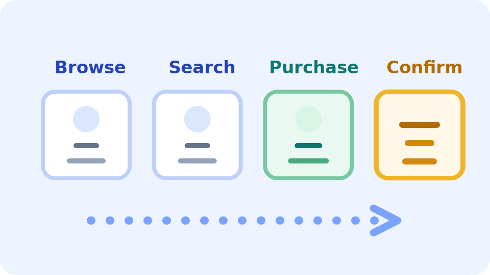

<!-- layout: title -->
# Critical User Journeys

Define the path that creates user value, then measure the path instead of isolated components.

---

<!-- layout: split:text-image -->
## What Counts as a CUJ

A critical user journey is the sequence of interactions a user must complete to get real value from the system.

  <ul>
    <li>It starts from the user goal, not the service topology.</li>
    <li>It includes front-end actions and backend dependencies.</li>
    <li>It becomes the frame for SLO design and incident priority.</li>
  </ul>

  

---

<!-- layout: split:text-text -->
## Core Concepts

These concepts give you a practical frame for defining and measuring a critical journey.

  <h3>Start with the journey</h3>
  
Reliability should protect what users are trying to accomplish.

  <h3>Model dependencies</h3>
  
Include both visible interactions and required systems behind them.

  <h3>Grade importance</h3>
  
Differentiate common tasks from moments where value is actually delivered.

  <h3>Measure the full path</h3>
  
Track the whole journey so completion failures show up as user-visible reliability issues.

---

<!-- layout: split:text-text -->
## Why CUJs Matter

CUJs make reliability work legible to both engineering and the business.

  <h3>Better SLO alignment</h3>
  
Objectives stay tied to user success instead of internal subsystem metrics.

  <h3>Clearer incident triage</h3>
  
A broken purchase flow deserves a different response than degraded browsing.

  <h3>Hidden weak-link discovery</h3>
  
Journey maps expose dependencies that can break completion even when single services look healthy.

  <h3>Sharper tradeoffs</h3>
  
Critical paths justify stricter targets and faster response.

---

## Example Journey: Online Shopping

Not every shopping action carries the same reliability weight. Focus on the steps where user intent turns into completed value.

  

    <strong>Browse product catalog</strong>
    <small>Useful, but not where user value is completed.</small>
  

  

    <strong>Search by keyword</strong>
    <small>Important discovery aid, but still pre-transaction.</small>
  

  

    <strong>Add item to cart</strong>
    <small>Begins the committed purchase path.</small>
  

  

    <strong>Complete purchase and payment</strong>
    <small>Value is realized here. This is the core critical activity.</small>
  

  

    <strong>Receive order confirmation</strong>
    <small>Important feedback, but secondary to transaction completion.</small>
  

---

## Signal Mapping

Each step should be paired with the signal that best exposes user-visible failure along the journey.

  

    <strong>Latency: Checkout submit</strong>
    <small>Slow submit flow is directly user-visible friction.</small>
  

  

    <strong>Availability: Payment authorization</strong>
    <small>Success or failure matters more than minor speed variation.</small>
  

  

    <strong>Latency: Checkout page load</strong>
    <small>Load time is a front-door signal for the purchase path.</small>
  

