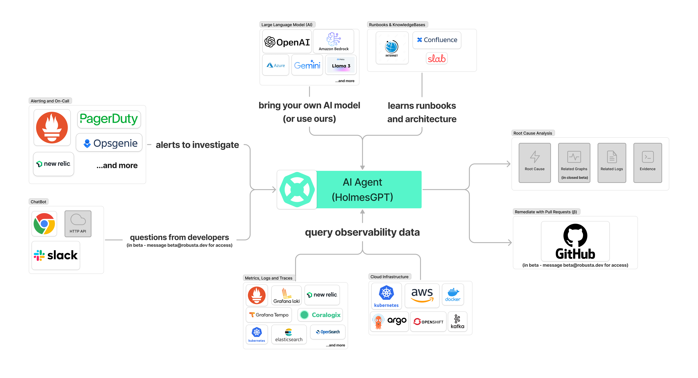

<!-- layout: title -->
# HolmesGPT Architecture

Learn why HolmesGPT works for incident debugging, where general agent stacks win, and how to choose the right operating model.

---

<!-- layout: split:text-image -->
## What HolmesGPT Optimizes For

HolmesGPT is strongest when incident response needs guided investigation rather than open-ended chat.

  <ul>
    <li>It starts from hypotheses instead of random tool calls.</li>
    <li>It loops through logs, metrics, traces, and cluster events with a troubleshooting plan.</li>
    <li>It aims to produce RCA and remediation actions, not just descriptive answers.</li>
  </ul>

  

---

## Architecture and Data Sources

The system works because it can correlate incident evidence from multiple channels, not because it has one smart model prompt.

Use the architecture map as a reminder of where investigation context actually comes from during RCA.

<ul>
  <li>Alerting and collaboration systems provide the starting signal.</li>
  <li>Observability, infrastructure, and runbooks supply evidence.</li>
  <li>The model layer turns structured evidence into diagnosis and next actions.</li>
</ul>

---

<!-- layout: image-caption -->

---

## Evidence Inputs

These are the main input classes HolmesGPT pulls together during incident analysis.

  

    <h3>Alerting and on-call systems</h3>
    
Paged incidents and alert signals entering the workflow.

    
<strong>Examples:</strong> PagerDuty, Opsgenie, New Relic alerts

  

  

    <h3>Developer questions and APIs</h3>
    
Interactive questions from responders and external API requests.

    
<strong>Examples:</strong> Slack, web UI, HTTP API

  

  

    <h3>Metrics, logs, and traces</h3>
    
Core observability telemetry queried during investigation.

    
<strong>Examples:</strong> Prometheus, Loki, Tempo, Elasticsearch

  

  

    <h3>Cloud, cluster, and knowledge context</h3>
    
Infrastructure state and runbooks that turn raw signals into operational judgment.

    
<strong>Examples:</strong> Kubernetes, AWS, Argo, Confluence, internal docs

  

---

## Concept Modules

  

    <strong>Purpose-built troubleshooting agent</strong>
    <small>Hypothesis-driven investigation beats generic model-wrapper behavior during incidents.</small>
  

  

    <strong>Embedded runbooks and incident patterns</strong>
    <small>Prepackaged playbooks reduce how much reasoning infrastructure teams must build themselves.</small>
  

  

    <strong>Tooling control over tool explosion</strong>
    <small>Curated commands and guided query plans improve consistency under pressure.</small>
  

  

    <strong>Cross-signal correlation</strong>
    <small>Real incidents require chaining metrics, logs, traces, events, and deploy history.</small>
  

  

    <strong>Integrated incident operations</strong>
    <small>Diagnosis should connect directly to paging, collaboration, tickets, and remediation workflows.</small>
  

  

    <strong>Product vs platform tradeoff</strong>
    <small>The architecture choice depends on domain fit, breadth, and the cost of custom playbooks.</small>
  

---

## Investigation Loop

The loop enforces evidence-backed progress instead of repetitive tool chatter.

  

    1
    <strong>Hypothesis</strong>
    <small>Start with candidate causes from user symptoms and alert metadata.</small>
  

  

    2
    <strong>Targeted query</strong>
    <small>Pull only the most relevant metrics, logs, traces, and cluster events.</small>
  

  

    3
    <strong>Evidence check</strong>
    <small>Validate or reject each hypothesis using observed signal alignment.</small>
  

  

    4
    <strong>Refine and branch</strong>
    <small>Promote likely causes, drop weak leads, and test the next branch.</small>
  

  

    5
    <strong>RCA and remediation</strong>
    <small>Publish root cause, confidence, and next actions for responders.</small>
  

---

## Cross-Signal Reasoning Path

A good RCA chain moves from symptom to infrastructure evidence to the actual change that broke the system.

  <article class="path-node fragment" data-fragment-index="1">
    1
    
API latency spike

  </article>
  <article class="path-node fragment" data-fragment-index="2">
    2
    
Pod CPU saturation

  </article>
  <article class="path-node fragment" data-fragment-index="3">
    3
    
Node pressure events

  </article>
  <article class="path-node fragment" data-fragment-index="4">
    4
    
Recent deployment diff

  </article>
  <article class="path-node fragment" data-fragment-index="5">
    5
    
Bad config and memory leak

  </article>

---

## Tool Load Scenarios

  

    <strong>Low tool load</strong>
    <small>Roughly 20 to 40 total tools. Generic MCP-style setups are usually manageable.</small>
  

  

    <strong>Rising coordination cost</strong>
    <small>Roughly 50 to 80 total tools. Curated tool plans and guardrails start to pay off.</small>
  

  

    <strong>Tool explosion zone</strong>
    <small>100 or more total tools. Structured workflows like HolmesGPT become much more reliable.</small>
  

---

## Practical Rule

Choose HolmesGPT when guided cloud-native RCA is the product you need now. Choose a broader agent platform when customization pressure is the main constraint. Use a hybrid model when both are true.
