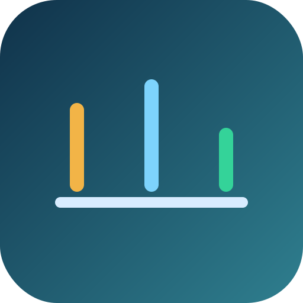

<!-- layout: title -->
# SLO-Based vs Threshold-Based Alerting

Learn when to page, when to warn, and when to debug. The operating pattern is simple: SLO alerts for paging, threshold alerts for early warning.

---

<!-- layout: split:text-image -->
## What Changes Between Alert Types

SLO alerts and threshold alerts answer different questions, so they should route to humans differently.

  <ul>
    <li>SLO alerts ask whether users are meaningfully impacted.</li>
    <li>Threshold alerts ask whether the system looks abnormal.</li>
    <li>Diagnostic signals explain why the condition is happening.</li>
  </ul>

  

---

<!-- layout: split:text-text -->
## Core Differences

These distinctions keep paging tied to user pain instead of raw infrastructure noise.

  <h3>SLO alerts ask user-impact questions</h3>
  
They page when reliability objectives are burning too fast and users are likely feeling it.

  <h3>Threshold alerts ask system-abnormal questions</h3>
  
They are strong early warnings and usually route to Slack, ticketing, or office-hours investigation.

  <h3>Both are useful in mature systems</h3>
  
SLO alerts drive paging. Threshold alerts help prevent incidents and speed diagnosis.

  <h3>Diagnostics explain the cause</h3>
  
Use supporting signals to understand why saturation, latency, or burn changed.

---

## Routing Logic

The routing rule depends on burn rate, impact, and whether the condition is sustained across windows.

  

    <strong>Observe</strong>
    <small>No urgent page signal. Keep diagnostics visible and monitor for trend changes.</small>
  

  

    <strong>Investigate</strong>
    <small>The system is abnormal, but SLO burn is not yet severe and sustained. Route as warning, not a page.</small>
  

  

    <strong>Page now</strong>
    <small>Users are likely feeling pain and the SLO burn is sustained. This is a paging event.</small>
  

---

## Practical Rule

Only SLO alerts should page humans. Threshold alerts should inform humans so teams can prevent incidents earlier.
